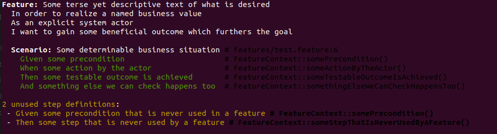

# Behat Unused Step Definitions Extension

Do you have a large Behat test suite? Would you like to check your feature
contexts for unused step definitions?
This Behat extension detects and reports step definitions that are not being
used in any of your `*.feature` files.

[](https://github.com/nicwortel/behat-unused-step-definitions-extension/blob/master/LICENSE.txt)
[](https://github.com/nicwortel/behat-unused-step-definitions-extension/blob/master/composer.json)
[](https://packagist.org/packages/nicwortel/behat-unused-step-definitions-extension)



## Installation

```bash
composer require --dev nicwortel/behat-unused-step-definitions-extension
```

Activate the extension in your `behat.yml`:

```yaml
default:
  extensions:
    NicWortel\BehatUnusedStepDefinitionsExtension\Extension: ~
```

## Usage

After following the installation steps as documented above, simply run Behat.
Instead of actually executing the tests, a dry run will be enough to collect
information about unused step definitions:

```bash
vendor/bin/behat --dry-run
```

Note that if you have multiple suites, the unused step definitions will be
listed per suite after the suite has finished.

### Filtering the results

#### Include / exclude

There are projects where it's important to avoid some step definitions to be
detected. For instance, when a project wants to avoid scanning unused step
definitions from the third-party packages/libraries and show only results from
the custom code. The extension allows to configure a list of
_regular expressions_ to include or exclude step definitions in the `behat.yml`
configuration file. Expressions are compared against the FQCN + method name
(`My\Namespace\ClassName::methodName`):

```yaml
default:
  extensions:
    NicWortel\BehatUnusedStepDefinitionsExtension\Extension:
      filters:
        include:
          - '/MyProject\\Behat\\Contexts/'
          - '/OtherProject\\Behat\\(Foo|Bar)Context/'
        exclude:
          - '/MyProject\\Behat\\Contexts\\FeatureContext/'
          - '/::excludedMethod/'
          - '/OtherProject\\Behat\\FooContext::.+Method/'
```

#### Ignore pattern aliases

Example:
```php
/**
 * @Then I take a screenshot
 * @Then I take a screenshot :name
 */
public function takeScreenshot(?string $name = NULL): void {
  // Step implementation.
}
```
If `I take a screenshot` is used but `I take a screenshot :name` is not,
enabling `ignorePatternAliases: true` will prevent the latter from being
reported as unused.

```yaml
default:
  extensions:
    NicWortel\BehatUnusedStepDefinitionsExtension\Extension:
      ignorePatternAliases: true
```

## Extending

By default, the extension uses the `unused_step_definitions_printer` printer,
shipped in the package. The printer displays the list of unused step definitions
in the console. Third-party Behat extension might provide different printers
(e.g. one may build a text file with the list of unused step definitions). A
custom printer should be defined as a container service and should implement the
`\NicWortel\BehatUnusedStepDefinitionsExtension\UnusedStepDefinitionsPrinter`
interface. Using a custom printer is possible by providing its service ID in the
`behat.yml` configuration file:

```yaml
default:
  extensions:
    NicWortel\BehatUnusedStepDefinitionsExtension\Extension:
      printer: my_custom_printer
```
